# 🛒 BarossPiac

> Iskolai második kézből való adás-vételi platform, kizárólag a **DSZC Baross Gábor Technikum** diákjainak.

[](https://react.dev/)
[](https://nodejs.org/)
[](https://tailwindcss.com/)
[](https://mariadb.org/)

---

## 📋 Tartalomjegyzék

- [A projektről](#a-projektről)
- [Funkciók](#funkciók)
- [Technológiák](#technológiák)
- [Adatbázis felépítése](#adatbázis-felépítése)
- [Oldalak és komponensek](#oldalak-és-komponensek)
- [Telepítés és futtatás](#telepítés-és-futtatás)
- [Teszt felhasználók](#teszt-felhasználók)
- [Fejlesztő](#fejlesztő)

---

## 📖 A projektről

A **BarossPiac** egy Vinted-ihlette iskolai online piactér, ahol a DSZC Baross Gábor Technikum tanulói egymás között adhatnak-vehetnek használt termékeket. A regisztráció kizárólag `@dszcbaross.edu.hu` végű iskolai email-címmel lehetséges, így a közösség zárt és biztonságos marad.

**Demo:** [https://barosspiac.netlify.app](https://barosspiac.netlify.app)  
**GitHub:** [https://github.com/s4nyi324145/barosspiac](https://github.com/s4nyi324145/barosspiac)

> 💡 A projekt vizsgaremekként készült a DSZC Baross Gábor Technikumban.

---

## ✨ Funkciók

### Felhasználóknak
- 🔐 Regisztráció és bejelentkezés iskolai email-címmel
- 📦 Termékek böngészése több szűrővel (kategória, állapot, méret, tantárgy, ár)
- 🔍 Valós idejű keresés
- ❤️ Termékek kedvencekhez adása
- 💬 Valós idejű chat az eladókkal (Socket.io)
- 🔔 Értesítési rendszer (üzenet, értékelés, eladás)
- ⭐ Felhasználók értékelése és értékelések szerkesztése
- 📸 Termékfeltöltés képekkel (Cloudinary)
- 🛒 Termékek eladottnak jelölése
- 🚩 Hirdetések és felhasználók jelentése

### Adminoknak
- 📊 Admin dashboard statisztikákkal
- 👥 Felhasználók kezelése (szerkesztés, törlés, szerepkör változtatás)
- 🏷️ Hirdetések kezelése (szerkesztés, törlés, eladottnak jelölés)
- 📋 Beérkező jelentések kezelése (elfogadás, elutasítás, törlés)

---

## 🛠️ Technológiák

### Frontend
| Technológia | Verzió | Felhasználás |
|---|---|---|
| React | 19.2 | UI keretrendszer |
| Vite | 7.3 | Build tool |
| TailwindCSS | 3.4 | Stílusok |
| React Router DOM | 7.13 | Oldalak közötti navigáció |
| Axios | 1.13 | HTTP kérések |
| Socket.io Client | 4.8 | Valós idejű chat |
| Lucide React | 0.572 | Ikonok |

### Backend
| Technológia | Verzió | Felhasználás |
|---|---|---|
| Node.js | v22.15.0 | Szerver futtatókörnyezet |
| Express | — | REST API |
| MariaDB | 10.4.32 | Adatbázis |
| Socket.io | — | WebSocket kapcsolat |
| JWT | — | Hitelesítés |
| bcrypt | — | Jelszó titkosítás |
| Multer | — | Fájlfeltöltés |
| Cloudinary | — | Képtárolás |

---

## 🗄️ Adatbázis felépítése

Az adatbázis neve: `s233_db`  
Szerver: `192.168.255.103:3306` (MariaDB 10.4.32)

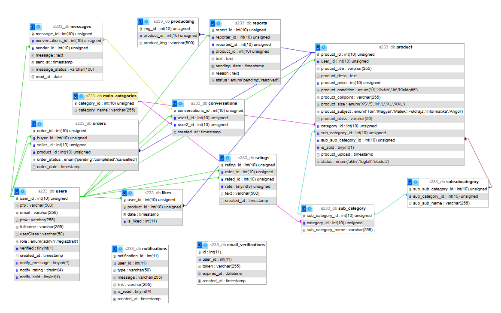

### Táblák

### Táblák áttekintése

| Tábla | Leírás |
|---|---|
| `users` | Felhasználók adatai, szerepkörök, értesítési beállítások |
| `product` | Termékek adatai, állapot, kategóriák, átvételi pont |
| `productimg` | Termékképek Cloudinary URL-jei |
| `main_categories` | 6 főkategória (Női, Férfi, Iskolai felszerelés, stb.) |
| `sub_category` | 24 alkategória |
| `subsubcategory` | 68 részletes kategória |
| `conversations` | Felhasználók közötti beszélgetések |
| `messages` | Üzenetek, olvasási állapottal |
| `likes` | Kedvelt termékek |
| `ratings` | Felhasználók egymásra adott értékelései |
| `reports` | Hirdetés- és felhasználójelentések |
| `notifications` | Értesítések típus szerint |
| `orders` | Megrendelések (vevő, eladó, termék) |
| `email_verifications` | Email megerősítési tokenek |

### Kategóriák

```
Főkategóriák (6):
├── Női
│   ├── Alap ruhadarabok → Pólók, Pulcsik, Farmer, Kabátok
│   ├── Cipők → Sportcipők, Bakancsok, Tornacipők
│   ├── Kiegészítők → Sapkák, Táskák, Övek, Ékszerek
│   └── Alkalmi ruhák → Szalagavatóra, Ballagásra, Bulikra
├── Férfi
│   └── (azonos struktúra mint Női)
├── Iskolai felszerelés
│   ├── Könyvek & jegyzetek → Tankönyvek, Munkafüzetek, Saját jegyzetek
│   ├── Írószerek → Tollak, Ceruzák, Markerek
│   ├── Táskák & tolltartók → Hátizsákok, Oldaltáskák, Tolltartók
│   └── Egyéb → Vonalzók, Körzők, Számológépek
├── Elektronika
│   ├── Számítástechnika → Laptopok, Egerek, Billentyűzetek, Fejhallgatók
│   ├── Telefonok → Okostelefonok, Tokok, Töltők
│   ├── Játék → Konzolok, Játékok, Kontrollerek
│   └── Egyéb → Hangszórók, Kábelek
├── Szórakozás
│   ├── Játékok → Társasjátékok, Kártyajátékok, Puzzle
│   ├── Sport → Labdák, Ütők, Védőfelszerelés
│   ├── Zene → Hangszerek, Kották
│   └── Könyvek → Regények, Képregények, Magazinok
└── Egyéb
    ├── Lakberendezés → Poszterek, Lámpák, Dekorációk
    ├── Élelmiszer → Házi készítésű finomságok
    ├── Szolgáltatások → Korrepetálás, Fotózás
    └── Minden más → Egyéb
```

---

## 📄 Oldalak és komponensek

### `/` — Főoldal

A látogatók számára elérhető nyitóoldal.

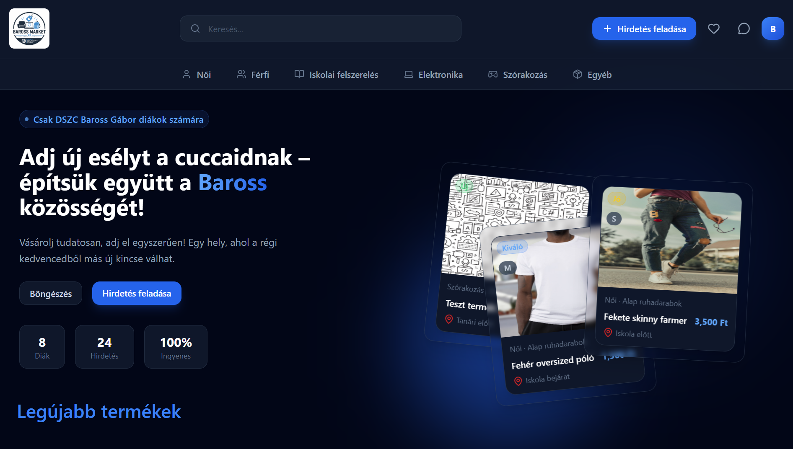

**Tartalom:**
- **Hero szekció** — animált statisztikák (regisztrált diákok száma, hirdetések száma), CTA gombok
- **Kategória sáv** — gyors navigáció a 6 főkategóriába
- **Legújabb termékek** — automatikusan mozgó kártya sor a legfrissebb hirdetésekkel
- **Közösség szekció** — az iskola zárt rendszerének bemutatása
- **Hogyan működik?** — 3 lépéses útmutató illusztrációkkal

---

### `/browser` — Böngészés / Szűrők


A termékek kereshetők és szűrhetők:

| Szűrő | Leírás |
|---|---|
| **Kategória** | Háromszintű kategória fa (főkategória → alkategória → típus) |
| **Ár** | Minimum és maximum ár megadása |
| **Állapot** | Új / Kiváló / Jó / Kielégítő |
| **Méret** | XS / S / M / L / XL / XXL |
| **Tantárgy** | Töri / Magyar / Matek / Földrajz / Informatika / Angol |
| **Rendezés** | Ár szerint növekvő/csökkenő, legújabb, legrégebbi |
| **Keresés** | Szabad szöveges keresés cím és leírás alapján |

Mobilon a szűrők egy slide-in panelen jelennek meg. Az aktív szűrők badge-ként látszanak, egyenként törölhetők.

---

### `/product/:id` — Termék részletes oldala

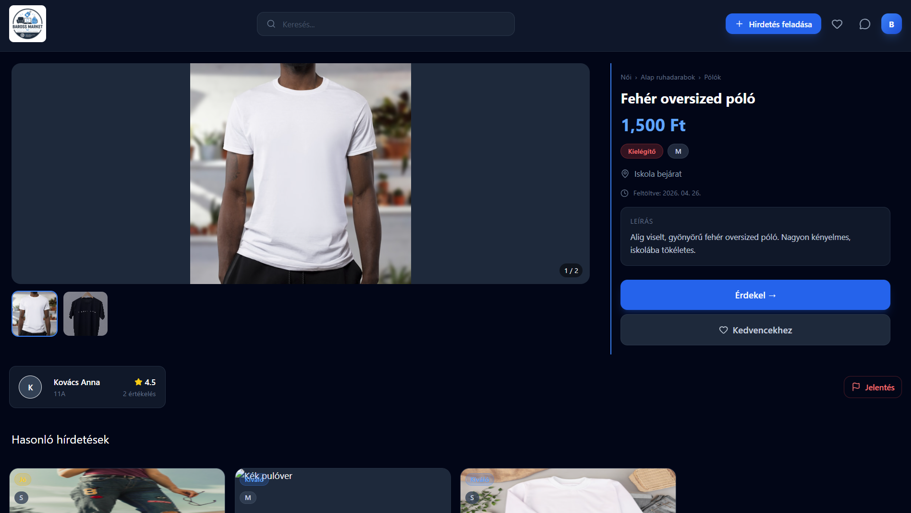

**Funkciók:**
- **Képgaléria** — főkép + thumbnail csík, lightbox nagyítás, kép számláló
- **Termék adatok** — cím, ár, kategória breadcrumb, állapot/méret/tantárgy badge-ek, leírás, feltöltés dátuma, átadás helye
- **Eladó info** — avatar, név, osztály, átlagos értékelés
- **Műveletek (vásárló):**
  - „Érdekel" gomb → automatikusan megnyitja a chatetet az eladóval
  - Kedvencekhez adás / eltávolítás
  - Hirdetés jelentése
- **Műveletek (saját hirdetés):**
  - Szerkesztés
  - Törlés (megerősítő modal-lal)
  - Eladottnak jelölés (visszavonható)
- **Hasonló hirdetések** — azonos alkategóriából

---

### `/upload` és `/upload/:id` — Hirdetés feladása / Szerkesztése

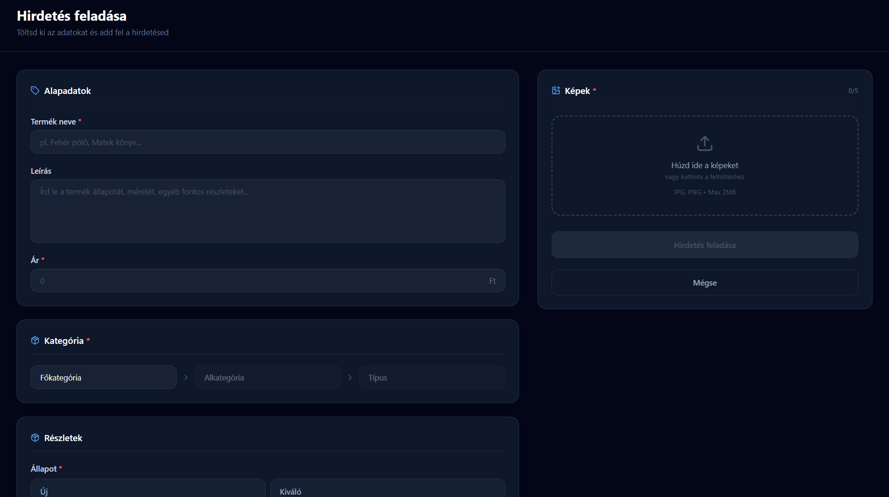
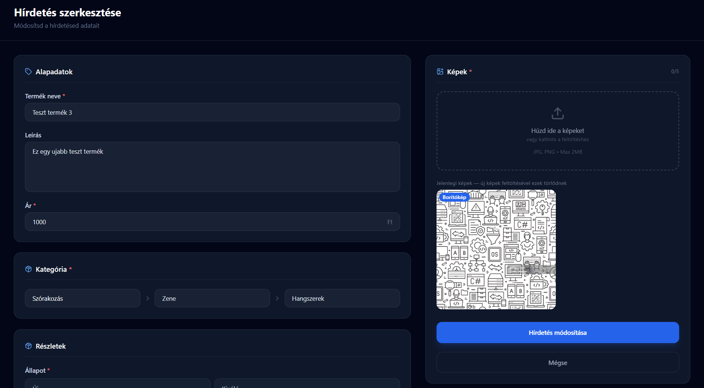

**Kitöltendő mezők:**
- Termék neve, leírás, ár
- Háromszintű kategória választó (dinamikusan töltődik)
- Állapot (4 opció kártyákkal)
- Méret (csak ruha kategóriáknál jelenik meg)
- Tantárgy (csak iskolai felszerelés kategóriánál jelenik meg)
- Átadás helye
- Képek feltöltése — drag & drop vagy kattintással, max. 5 kép, előnézettel

A kitöltött adatok localStorage-ben mentődnek, így oldalfrissítés után sem vesznek el. Szerkesztés módban a meglévő képek láthatók, és csak új képek feltöltésekor cserélődnek.

---

### `/profile/:id` — Profil oldal

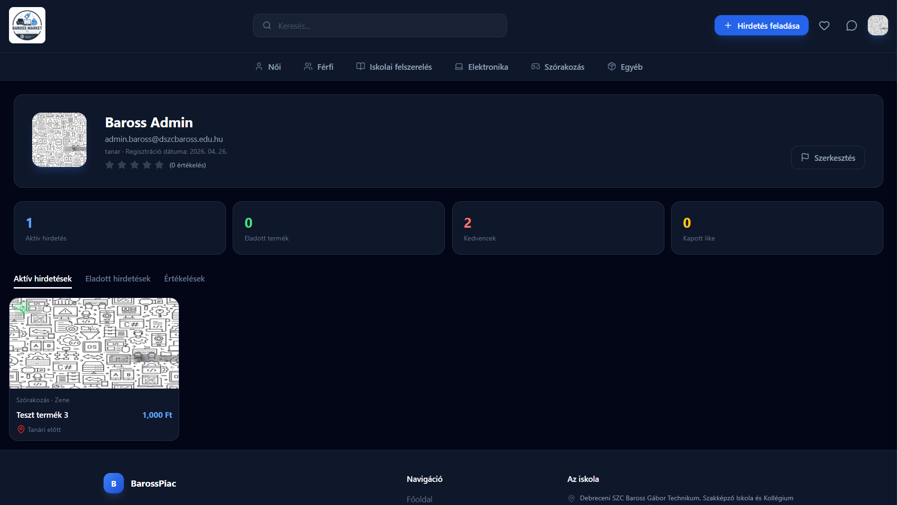

**Tartalom:**
- Profilkép, név, email, osztály, regisztráció dátuma
- Csillagos értékelés átlag + értékelések száma
- **Animált statisztikák** — aktív hirdetések, eladott termékek, kedvencek, kapott like-ok száma (0-tól számol fel)
- **Tabbok:**
  - Aktív hirdetések
  - Eladott hirdetések
  - Értékelések (más profiljánál értékelés írása gomb is megjelenik)

Ha saját profilunkat nézzük, a kedvencek száma is megjelenik és szerkesztés gomb vezet a beállításokhoz.

---

### `/messages` — Üzenetek / Chat

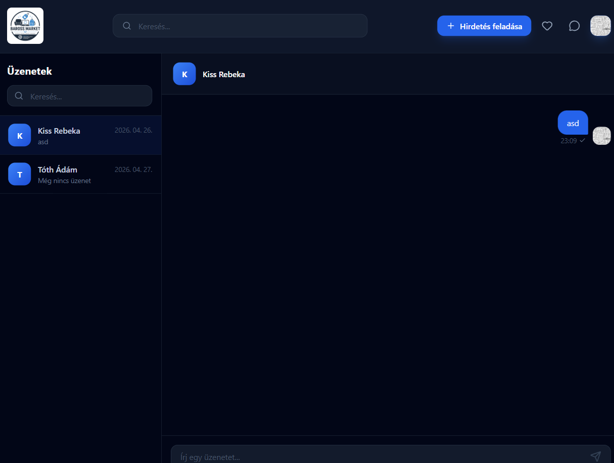

**Funkciók:**
- Conversations lista — összes aktív beszélgetés, olvasatlan üzenet számláló badge-el
- Keresés a conversations listában
- **Valós idejű chat (Socket.io):**
  - Azonnali üzenetküldés
  - Optimistic update (az üzenet azonnal megjelenik, majd szerver válasz után frissül)
  - Olvasási visszaigazolás (✓ = elküldve, ✓✓ kék = olvasva)
  - Üzenet törlése jobb klikkel
  - Automatikus görgetés az utolsó üzenethez
- Mobilon a conversations lista és a chat panel felváltva jelenik meg

---

### `/likes` — Kedvencek


**Funkciók:**
- Összes kedvelt termék listázása
- Rendezés (ár, dátum szerint)
- Összes kedvenc törlése megerősítő modal-lal

---

### `/notifications` — Értesítések


**Értesítés típusok:**

| Típus | Ikon | Szín |
|---|---|---|
| Új üzenet | 💬 | Kék |
| Új értékelés | ⭐ | Sárga |
| Termék eladva | 🏷️ | Zöld |
| Jelentés | 🚩 | Piros |

Olvasatlan értékelések bal szélén kék csík jelzi. Minden értékelés egyenként törölhető megerősítő modal-lal, vagy egyszerre az „Összes olvasottnak jelölése" gombbal.

---

### `/settings` — Beállítások


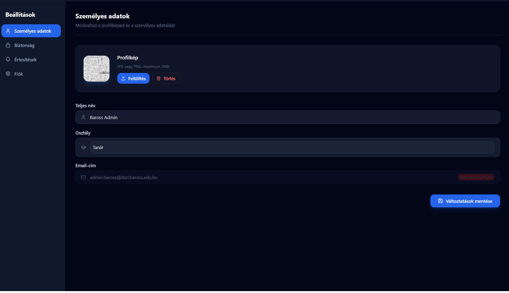

**4 fül:**

**Személyes adatok**
- Profilkép feltöltése / törlése (Cloudinary)
- Teljes név és osztály módosítása

**Biztonság**
- Jelszó megváltoztatása (jelenlegi jelszó ellenőrzéssel)
- Jelszóerősség jelző (gyenge / közepes / erős)

**Értesítések**
- Toggle kapcsolók: Új üzenet / Új értékelés / Termék eladva

**Fiók**
- Regisztráció dátuma, szerepkör, email megerősítés státusz
- Fiók törlése (jelszó megerősítéssel)

---

### `/admin` — Admin panel

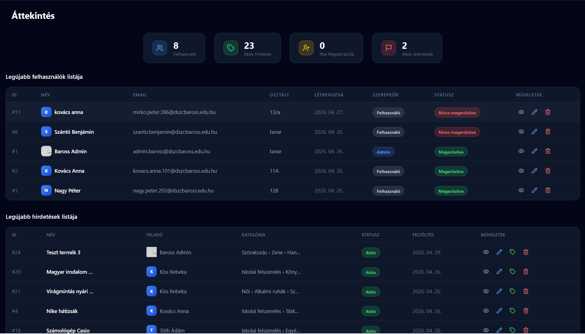

**Áttekintés (Dashboard)**
- Statisztika kártyák: összes felhasználó, aktív hirdetések, mai regisztrációk, aktív jelentések
- Legújabb felhasználók táblázata
- Legújabb hirdetések táblázata

**Felhasználók kezelése**
- Teljes táblázat lapozással (10 felhasználó/oldal)
- Soron belüli szerkesztés (név, email, osztály, szerepkör, megerősítési státusz)
- Felhasználó törlése

**Hirdetések kezelése**
- Teljes táblázat lapozással (10 hirdetés/oldal)
- Soron belüli szerkesztés (cím, kategória)
- Hirdetés törlése, eladottnak jelölése / visszaállítása

**Jelentések kezelése**
- Termék- és felhasználójelentések listája
- Lezárás, elutasítás, törlés
- Kattintásra kibővül a részletes leírással
- Státusz filterek (függőben / lezárva / elutasítva)

---

### `/login` és `/register` — Bejelentkezés / Regisztráció

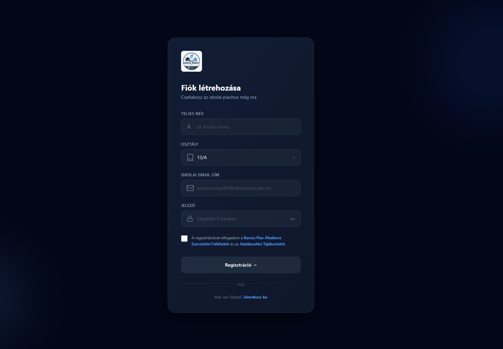

**Regisztráció:**
- Teljes név, osztály (legördülő), iskolai email, jelszó
- Jelszóerősség jelző
- ÁSZF és adatkezelési tájékoztató modal-ban megtekinthető, el kell fogadni
- Csak `@dszcbaross.edu.hu` végű email fogadható el


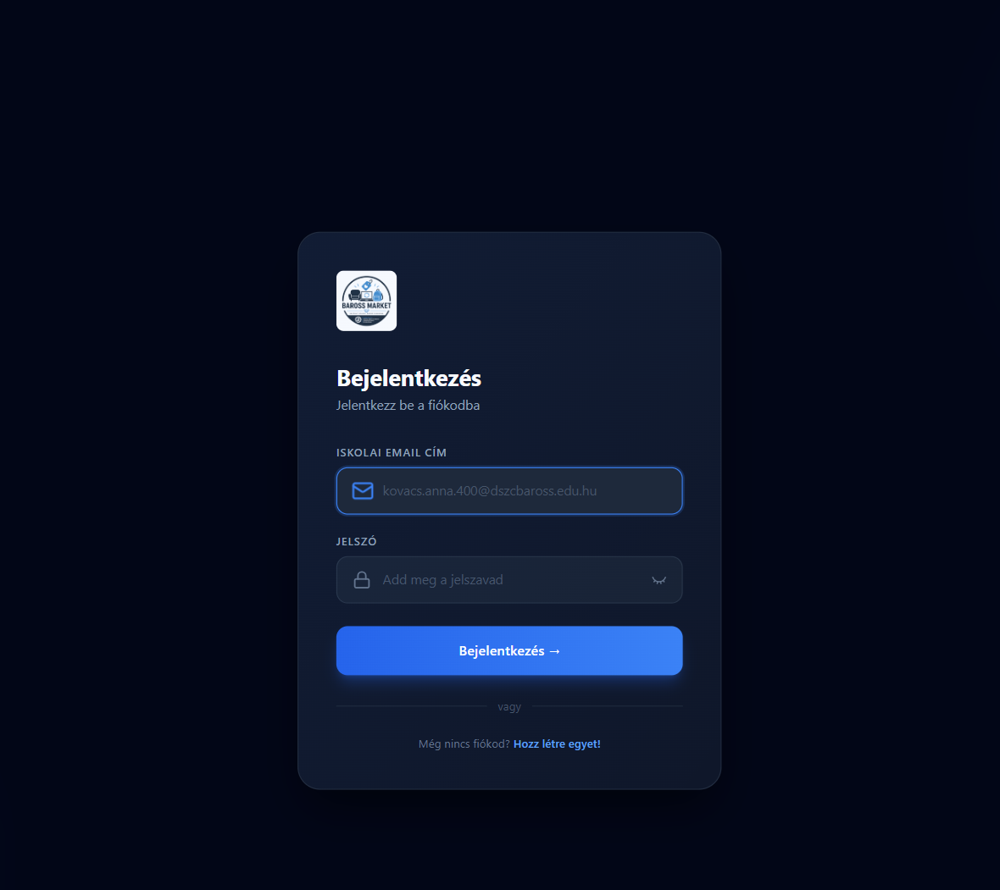

**Bejelentkezés:**
- Email + jelszó
- Hibás mezők piros kerettel jelölve

---

## 🚀 Telepítés és futtatás

### Követelmények
- Node.js v22.15.0+
- MariaDB 10.4.32
- Cloudinary fiók

### Backend

```bash
# Repo klónozása
git clone https://github.com/s4nyi324145/barosspiac.git
cd barosspiac/backend

# Függőségek telepítése
npm install

# .env fájl létrehozása
cp .env.example .env
```

`.env` fájl tartalma:
```env
DB_HOST=192.168.255.103
DB_PORT=3306
DB_USER=<felhasználónév>
DB_PASSWORD=<jelszó>
DB_NAME=barosspiac3
JWT_SECRET=<titkos_kulcs>
CLOUDINARY_CLOUD_NAME=<cloud_name>
CLOUDINARY_API_KEY=<api_key>
CLOUDINARY_API_SECRET=<api_secret>
PORT=22014
```

```bash
# Adatbázis importálása
mysql -u root -p barosspiac3 < database/barosspiac3.sql

# Szerver indítása
node server.js
```

### Frontend

```bash
cd ../frontend

# Függőségek telepítése
npm install

# Fejlesztői szerver indítása
npm run dev
```

A frontend alapértelmezetten a `http://localhost:5173` címen érhető el,  
a backend a `http://localhost:22014` porton fut.

---

## 👤 Teszt felhasználók

> Minden fiók jelszava: **`Baross123!`**

| Név | Email | Szerepkör |
|---|---|---|
| Baross Admin | `admin.baross@dszcbaross.edu.hu` | Admin |
| Kovács Anna | `kovacs.anna.101@dszcbaross.edu.hu` | Felhasználó |
| Nagy Péter | `nagy.peter.202@dszcbaross.edu.hu` | Felhasználó |
| Szabó Eszter | `szabo.eszter.303@dszcbaross.edu.hu` | Felhasználó |
| Tóth Ádám | `toth.adam.404@dszcbaross.edu.hu` | Felhasználó |
| Kiss Rebeka | `kiss.rebeka.505@dszcbaross.edu.hu` | Felhasználó |

---

## 🔌 API végpontok áttekintése

### Felhasználók (`/api/user`)
| Metódus | Végpont | Leírás | Auth |
|---|---|---|---|
| POST | `/register` | Regisztráció | — |
| POST | `/login` | Bejelentkezés | — |
| GET | `/me` | Bejelentkezett user adatai | ✅ |
| POST | `/user` | Adatok módosítása | ✅ |
| PUT | `/password` | Jelszó módosítása | ✅ |
| POST | `/profile_pic` | Profilkép feltöltése | ✅ |
| DELETE | `/profile_pic` | Profilkép törlése | ✅ |
| GET | `/statistic/:id` | Profil statisztikák | — |
| GET | `/alluser?page=N` | Összes felhasználó | 🔒 Admin |
| PUT | `/update/:id` | Felhasználó módosítása | 🔒 Admin |
| DELETE | `/delete/:id` | Felhasználó törlése | 🔒 Admin |

### Termékek (`/api/product`)
| Metódus | Végpont | Leírás | Auth |
|---|---|---|---|
| GET | `/getProduct` | Összes aktív termék | — |
| GET | `/latestProduct` | Legújabb 10 termék | — |
| GET | `/:id` | Termék részletei + képek | — |
| GET | `/active_product/:user_id` | Felhasználó aktív hirdetései | — |
| GET | `/sold_product/:user_id` | Felhasználó eladott hirdetései | — |
| GET | `/similar/:sub_id/:product_id` | Hasonló hirdetések | — |
| POST | `/postProduct` | Hirdetés feladása (multipart) | ✅ |
| PUT | `/update` | Hirdetés szerkesztése | ✅ |
| PUT | `/sold/:id` | Eladottnak jelölés | ✅ |
| DELETE | `/:id` | Hirdetés törlése | ✅ |
| GET | `/allproduct?page=N` | Összes hirdetés | 🔒 Admin |

### Üzenetek és beszélgetések
| Metódus | Végpont | Leírás |
|---|---|---|
| POST | `/api/conversations/conversation` | Beszélgetés indítása |
| GET | `/api/conversations/conversations` | Saját beszélgetések |
| GET | `/api/messages/message/:conv_id` | Üzenetek lekérése |
| GET | `/api/messages/unreaded` | Olvasatlan üzenetek száma |
| PUT | `/api/messages/read/:conv_id` | Olvasottnak jelölés |

### Socket.io események
| Esemény | Irány | Leírás |
|---|---|---|
| `join_conversation` | Client → Server | Belép a szoba-ba |
| `send_message` | Client → Server | Üzenet küldése |
| `receive_message` | Server → Client | Üzenet fogadása |
| `delete_message` | Client → Server | Üzenet törlése |
| `message_deleted` | Server → Client | Üzenet törölve értesítés |
| `mark_as_read` | Client → Server | Olvasottnak jelölés |
| `messages_read` | Server → Client | Olvasva visszaigazolás |

---

## 👨‍💻 Fejlesztő

**Szűcs Márton Sándor** 
**Szabó Előd**  
DSZC Baross Gábor Technikum  

- GitHub: [github.com/s4nyi324145](https://github.com/s4nyi324145)
- Projekt: [barosspiac.netlify.app](https://barosspiac.netlify.app)

---

## 📝 Megjegyzések

- Az alkalmazás kizárólag oktatási célból készült vizsgaremekként
- A regisztráció zárt, csak `@dszcbaross.edu.hu` végű email-cím fogadható el
- Az átadások személyesen, az iskolában zajlanak — nincs szállítás, nincs online fizetés
- A képek tárolása Cloudinary-n történik

---

*© 2026 BarossPiac — DSZC Baross Gábor Technikum*