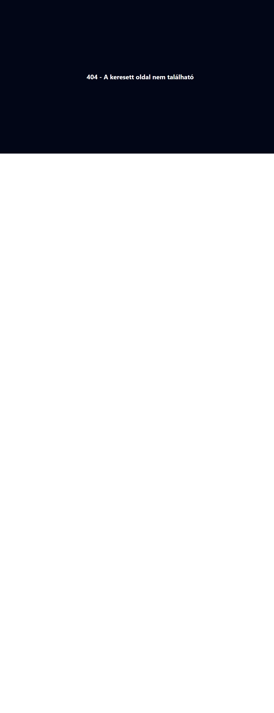

# Baross Piac – Frontend Dokumentáció


A **Baross Piac** egy használt termékek adásvételére készült webalkalmazás, amelyet kizárólag a **DSZC Baross Gábor Technikum tanulói** használhatnak. A projekt célja egy biztonságos, átlátható és könnyen kezelhető online piactér létrehozása volt, ahol a felhasználók termékeket böngészhetnek, feltölthetnek, kedvencekhez adhatnak, értékelhetnek, jelenthetnek, valamint egymással üzenetben is kommunikálhatnak.

A frontend **React** alapokra épül, **Vite** fejlesztői környezetben készült, a teljes felület pedig **Tailwind CSS** segítségével lett kialakítva. Az alkalmazás a backenddel API-hívásokon keresztül kommunikál, a valós idejű funkciókhoz pedig **Socket.IO Client** támogatást használ.

<!-- Ide jön kép: images/home-hero.png -->


---

## Tartalomjegyzek

- [A projektrol](#a-projektrol)
- [Keszitok](#keszitok)
- [Linkek](#linkek)
- [Fobb funkciok](#fobb-funkciok)
- [Hasznalt technologiak](#hasznalt-technologiak)
- [Fejlesztesi kornyezet es telepites](#fejlesztesi-kornyezet-es-telepites)
- [Elerheto npm scriptek](#elerheto-npm-scriptek)
- [Frontend felepitese](#frontend-felepitese)
- [Route-ok](#route-ok)
- [Oldalak reszletes bemutatasa](#oldalak-reszletes-bemutatasa)
- [Szerepkorok](#szerepkorok)
- [Reszponzivitas](#reszponzivitas)
- [Backend kapcsolat](#backend-kapcsolat)
- [Kodminoseg](#kodminoseg)
- [Teszteles](#teszteles)
- [Tovabbfejlesztesi lehetosegek](#tovabbfejlesztesi-lehetosegek)
- [Kepek beszurasa a README-be](#kepek-beszurasa-a-readme-be)
- [Licenc](#licenc)

---

## A projektrol

A **Baross Piac** egy zárt közösségi piactér, amely kifejezetten a **DSZC Baross Gábor Technikum tanulói** számára készült. A weboldal lehetőséget biztosít arra, hogy a felhasználók használt tárgyaikat egyszerűen meghirdessék, mások termékeit böngésszék, kapcsolatba lépjenek egymással, valamint biztonságosabb és átláthatóbb módon adjanak-vegyenek az iskola közösségén belül.

A rendszer célja az volt, hogy egy modern, letisztult és jól használható felületet biztosítson a következő funkciókhoz:

- regisztráció és bejelentkezés
- termékek böngészése
- új termék feltöltése
- meglévő termék szerkesztése
- profilkezelés
- profilkép feltöltés
- kedvencek használata
- értékelések kezelése
- termékek vagy felhasználók jelentése
- üzenetküldés
- értesítések
- adminisztráció és moderáció

A frontend teljes egészében elkészült, és minden tervezett fő funkció működőképes.

---

## Keszitok

- **Szűcs M. Sándor**
- **Szabó Előd**

---

## Linkek

- **Frontend GitHub repo:** https://github.com/s4nyi324145/barosspiac.git
- **Demo:** https://barosspiac.netlify.app/

---

## Fobb funkciok

A Baross Piac frontendje az alábbi funkciókat valósítja meg:

- felhasználói regisztráció
- bejelentkezés
- főoldal
- termékek böngészése
- termék részleteinek megtekintése
- termékek feltöltése
- termékek szerkesztése
- felhasználói profilok megtekintése
- profilkép feltöltés
- saját beállítások módosítása
- kedvencek kezelése
- értékelési rendszer
- jelentés / report rendszer
- privát üzenetek
- értesítések
- admin panel
- egyedi 404 oldal

---

## Hasznalt technologiak

### Frontend technológiák

| Technológia | Verzió | Leírás |
|------------|--------|--------|
| **React** | `19.2.0` | Komponens alapú frontend könyvtár |
| **React DOM** | `19.2.0` | A React komponensek megjelenítése böngészőben |
| **React Router DOM** | `7.13.0` | Kliensoldali útvonalkezelés |
| **Axios** | `1.13.5` | HTTP kérések küldése a backend felé |
| **Socket.IO Client** | `4.8.3` | Valós idejű kommunikáció |
| **Lucide React** | `0.572.0` | Ikonok használata |
| **Tailwind CSS** | `3.4.19` | Utility-first stílusozás |
| **Vite** | `7.3.1` | Gyors fejlesztői és build környezet |

### Fejlesztői csomagok

| Technológia | Verzió | Leírás |
|------------|--------|--------|
| **ESLint** | `9.39.1` | Kódellenőrzés és hibakeresés |
| **PostCSS** | `8.5.6` | Tailwind feldolgozás támogatása |
| **Autoprefixer** | `10.4.24` | CSS prefixek automatikus kezelése |
| **@vitejs/plugin-react** | `5.1.1` | React támogatás Vite alatt |

---

## Fejlesztesi kornyezet es telepites

### Klónozás

```bash
git clone https://github.com/s4nyi324145/barosspiac.git
cd barosspiac
Függőségek telepítése
Bash

npm install
Fejlesztői szerver indítása
Bash

npm run dev

Frontend felepitese
A frontend React komponensekre épül, és az oldalak közötti navigációt a React Router DOM kezeli. A projekt Vite segítségével lett inicializálva, így a fejlesztési környezet gyors és hatékony.

A stílusozás teljes egészében Tailwind CSS-sel történt, tehát a projektben nincsenek külön oldalankénti CSS fájlok. Ehelyett a komponensek megjelenése közvetlenül a JSX-ben, utility class-ek segítségével lett meghatározva.

Ennek előnyei:

gyorsabb UI fejlesztés
egységesebb megjelenés
egyszerűbb reszponzív kialakítás
könnyebb karbantarthatóság
jól elkülönített komponens alapú struktúra
<!-- Ide jön kép: images/responsive-showcase.png -->
Route-ok
A frontendben az alábbi route-ok vannak használva:

React

<Routes>
  <Route path="/register" element={<Register />} /> 
  <Route path="/login" element={<Login />} />
  <Route path="/" element={<Home />} />
  <Route path="/browser" element={<Browser />} />
  <Route path="/product/:product_id" element={<ProductDetails />} />
  <Route path="/likes" element={<Favorites />} />
  <Route path="/profile/:user_id" element={<Profile/>}/>
  <Route path="/settings" element={<Settings/>}/>
  <Route path="/upload" element={<Upload/>}/>
  <Route path="/upload/:product_id" element={<Upload/>}/>
  <Route path="/messages" element={<Messages/>}/>
  <Route path="/notifications" element={<Notifications/>}/>
  <Route path="/admin" element={<Admin/>}/>
  <Route path="*" element={<PageNotFounnd/>} />
</Routes>
Oldalak reszletes bemutatasa
1. Regisztráció – /register
A regisztrációs oldal új felhasználók számára készült. Ezen az oldalon lehet új fiókot létrehozni, hogy a felhasználó elérhesse a piactér funkcióit.

Fő feladatai:

űrlapmezők kezelése
kliensoldali validáció
hibák megjelenítése
sikeres regisztráció kezelése

2. Bejelentkezés – /login
A bejelentkezési oldal a már regisztrált felhasználók számára biztosít belépést.

Fő feladatai:

belépési adatok kezelése
hitelesítési kérés küldése a backendnek
hibakezelés
sikeres belépés után átirányítás

3. Főoldal – /
A főoldal a rendszer nyitófelülete, ahonnan a felhasználó elérheti a legfontosabb funkciókat és navigálhat a többi oldalra.

Fő feladatai:

bemutató felület biztosítása
navigáció a piactér fő részeire
kiemelt tartalmak megjelenítése

4. Böngészés – /browser
A böngészőoldal a termékek listázására szolgál, ahol a felhasználó több hirdetést is áttekinthet.

Fő feladatai:

termékek lekérése és megjelenítése
kártyás lista kialakítása
navigáció a részletes termékoldalakra

5. Termék részletei – /product/:product_id
Ez az oldal egy adott termék teljes adatlapját jeleníti meg.

Lehetséges funkciók ezen az oldalon:

termékadatok megjelenítése
képek megjelenítése
kedvencekhez adás
értékelés
jelentés
kapcsolatfelvétel az eladóval
Frontend feladatai:

dinamikus route paraméter kezelése
konkrét termék lekérése
felhasználói interakciók kezelése

6. Kedvencek – /likes
A kedvencek oldal a felhasználó által elmentett termékeket jeleníti meg.

Fő feladatai:

mentett termékek listázása
kedvencekből való eltávolítás
gyors navigáció a termékekhez

7. Profil – /profile/:user_id
A profiloldalon a felhasználó saját vagy más felhasználó profilját nézheti meg.

Fő feladatai:

profiladatok megjelenítése
profilkép megjelenítése
feltöltött termékek listázása
értékelések megjelenítése

8. Beállítások – /settings
A beállítások oldal a saját fiók adatainak módosítására szolgál.

Fő feladatai:

személyes adatok módosítása
jelszó módosítása
profilkép feltöltése vagy cseréje
felhasználói beállítások kezelése

9. Termék feltöltése – /upload
Az oldal új termék létrehozására szolgál.

Fő feladatai:

cím, leírás és egyéb mezők kitöltése
képfeltöltés
adatok ellenőrzése
új termék beküldése a backend felé

10. Termék szerkesztése – /upload/:product_id
Ugyanaz a komponens meglévő termék szerkesztésére is használható.

Fő feladatai:

meglévő adatok lekérése
mezők előtöltése
módosítások mentése

11. Üzenetek – /messages
Az üzenetküldő felület a felhasználók közötti kommunikációt biztosítja.

Fő feladatai:

beszélgetések megjelenítése
üzenetek küldése és fogadása
valós idejű frissítés Socket.IO segítségével

12. Értesítések – /notifications
Az értesítések oldal a felhasználóhoz kapcsolódó aktivitásokat és rendszereseményeket jeleníti meg.

Fő feladatai:

értesítések listázása
olvasott / olvasatlan állapot kezelése
kapcsolódó tartalmak gyors elérése

13. Admin panel – /admin
Az admin felület a rendszer moderálására és kezelésére szolgál.

Lehetséges admin funkciók:

felhasználók kezelése
termékek moderálása
jelentések kezelése
adminisztratív műveletek
Frontend feladatai:

admin jogosultsághoz kötött felület megjelenítése
adatok listázása
moderációs műveletek támogatása

14. 404 oldal – *
A hibás vagy nem létező útvonalakhoz tartozó egyedi oldal.

Fő feladatai:

felhasználó tájékoztatása
visszanavigálási lehetőség biztosítása

Szerepkorok
Vendég felhasználó
főoldal megtekintése
böngészés
regisztráció
bejelentkezés
Bejelentkezett felhasználó
termékek böngészése
termék részleteinek megtekintése
termékek feltöltése
saját termékek szerkesztése
kedvencek kezelése
értékelés
jelentés küldése
profil megtekintése
profilkép kezelése
beállítások módosítása
üzenetküldés
értesítések megtekintése
Admin
minden felhasználói jogosultság
admin panel használata
jelentések kezelése
moderáció
tartalomfelügyelet
Reszponzivitas
A frontend Tailwind CSS használatával készült, ezért különböző képernyőméreteken is jól használható.

A kialakítás célja az volt, hogy az oldal megfelelően működjön:

asztali gépen
laptopon
tableten
mobiltelefonon
A komponensek kialakítása során fontos szempont volt a rugalmas elrendezés, az átlátható navigáció és a könnyű kezelhetőség kisebb kijelzőkön is.

Backend kapcsolat
Ez a repository a projekt frontend részét tartalmazza. A frontend a backenddel API-hívásokon keresztül kommunikál.

A backend kapcsolat főbb területei:

hitelesítés
felhasználói adatok kezelése
termékek lekérése és feltöltése
kedvencek
értékelések
jelentések
admin funkciók
üzenetek
értesítések
A valós idejű funkciókhoz a frontend Socket.IO Client csomagot használja.

Kodminoseg
A projektben ESLint van használva a kódminőség fenntartására.

Ez segít:

a gyakori hibák kiszűrésében
az egységes kódstílus fenntartásában
a React hook-ok helyes használatának ellenőrzésében
az átláthatóbb fejlesztésben
Teszteles
A frontend funkciói manuálisan tesztelhetők az alábbi területeken:

regisztráció
bejelentkezés
navigáció
termékfeltöltés
termék szerkesztés
kedvencek
értékelések
jelentések
profil és beállítások
üzenetek
értesítések
admin panel
hibakezelés
reszponzív megjelenítés
Tovabbfejlesztesi lehetosegek
Bár a projekt jelenleg is teljes funkcionalitással rendelkezik, a későbbiekben tovább bővíthető például az alábbiakkal:

fejlettebb keresési és szűrési lehetőségek
többnyelvű támogatás
részletesebb admin statisztikák
automatizált frontend tesztek
fejlettebb felhasználói értékelési rendszer
még részletesebb moderációs eszközök

